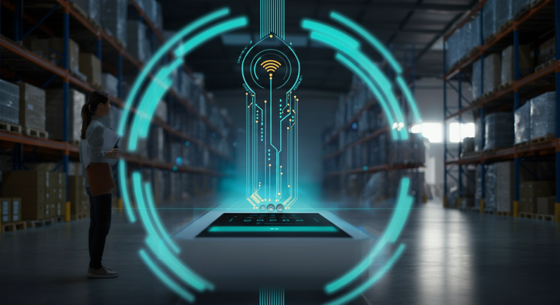

「毎日の棚卸しに何時間もかかっている…」
「入出荷検品で数が合わず、原因調査にいつも追われている…」
「探している在庫が、倉庫のどこにあるのかすぐに見つからない…」

物流の現場で働く担当者や倉庫管理者の皆様なら、一度はこのような課題に直面したことがあるのではないでしょうか。人手不足が深刻化する中、これらの作業にかかる時間と労力は、経営を圧迫する大きな要因となり得ます。

もし、箱を開けずに中身を瞬時に把握できたり、倉庫のどこに何があるかをリアルタイムで可視化できたりしたら、現場はどのように変わるでしょうか？

その鍵を握るのが、今回ご紹介する**「RFID（アールエフアイディー）」**です。本記事では、物流現場の課題を解決する切り札として注目されるRFID導入について、その基礎知識からメリット、導入時の注意点まで、分かりやすく解説していきます。

## RFID導入とは？物流現場の「目」を増やす新技術

RFID導入とは、**電波を用いて非接触で情報を読み書きする「RFID」という技術を、自社の業務プロセスに組み込むこと**を指します。特に物流業界では、在庫管理や入出荷検品などの業務を自動化・効率化するために活用されています。

これまでのバーコード管理が「一つひとつ目で見てスキャンする」運用だったのに対し、RFIDは「電波の届く範囲にあるものを一括で読み取る」ことができるため、作業効率を劇的に向上させるポテンシャルを秘めています。

### RFIDの仕組みを分かりやすく解説

RFIDシステムは、主に以下の3つの要素で構成されています。

1.  **RFIDタグ（ICタグ）**: 商品やパレットなど、管理したいモノに取り付ける「電子的な名札」です。内部には情報を記録したICチップと、電波を送受信するためのアンテナが内蔵されています。
2.  **リーダーライター**: RFIDタグの情報を読み取ったり、新しい情報を書き込んだりする「読み書き装置」です。ハンディ型やゲート型など、用途に応じて様々な形状があります。
3.  **アンテナ**: リーダーライターに接続し、RFIDタグとの間で電波を送受信する役割を担います。

この3つが連携し、「リーダーライターが電波を発信 → タグがその電波を受けて内部情報を返信 → リーダーライターが情報を受信してデータ化する」という流れで、情報を読み取ります。

### バーコードとの違いは？

RFIDのすごさを理解するために、これまで主流だったバーコードと比較してみましょう。その違いは一目瞭然です。

| 比較項目           | RFID                                                                   | バーコード                                                     |
| ------------------ | ---------------------------------------------------------------------- | -------------------------------------------------------------- |
| **読み取り方式**   | 非接触（電波）                                                         | 光学式（レーザーなど）                                         |
| **複数同時読み取り** | **可能**（箱の中のタグも一括で読み取れる）                               | **不可能**（一つずつスキャンする必要がある）                     |
| **読み取り距離**   | 広い（数cm～数m以上）                                                  | 狭い（数cm～数十cm）                                           |
| **遮蔽物の影響**   | 受けにくい（段ボールなどを透過して読み取れる）                         | 受けやすい（汚れやシワ、遮蔽物があると読み取れない）           |
| **情報の書き換え** | 可能（タグに新しい情報を追記・更新できる）                             | 不可能                                                         |
| **コスト**         | 比較的高価（タグ1枚あたり数円～数十円）                                | 安価                                                           |

このように、RFIDはバーコードの弱点を克服し、より高度で効率的な管理を実現する技術なのです。

## RFID導入がもたらす5つの大きなメリット

RFIDを導入することで、物流現場は具体的にどのように変わるのでしょうか。代表的な5つのメリットをご紹介します。

### 1. 棚卸し・検品作業の大幅な効率化
最大のメリットは、作業時間の劇的な短縮です。RFIDリーダーを使えば、段ボール箱を開けることなく、複数の商品を一瞬でスキャンできます。これまで数人がかりで丸一日かかっていた棚卸し作業が、一人で数時間に短縮されたという事例も珍しくありません。

### 2. 在庫管理精度の飛躍的な向上
「理論在庫と実在庫が合わない」という悩みは、ヒューマンエラーが大きな原因です。RFIDは機械的に一括で読み取るため、数え間違いやスキャン漏れといった人為的ミスを限りなくゼロに近づけることができます。リアルタイムで正確な在庫数を把握できるため、欠品による販売機会の損失や、過剰在庫のリスクを低減します。

### 3. トレーサビリティの強化
トレーサビリティとは、製品が「いつ、どこで、誰によって」作られ、流通したのかを追跡できる状態のことです。RFIDタグに個別のIDを割り振り、入荷から保管、出荷までの各工程で読み取ることで、モノの動きを正確に記録・追跡できます。品質問題が発生した際の迅速な原因究明や、リコール対応の効率化に繋がります。

### 4. 誤出荷の防止
出荷エリアにゲート型のRFIDリーダーを設置すれば、作業員が商品を持ってゲートを通過するだけで、出荷指示と内容物が一致しているかを自動で照合できます。もし間違った商品や数量が混入していれば、その場でアラートを鳴らすといった仕組みも構築でき、誤出荷を未然に防ぎます。

### 5. 付加価値の高い業務へのシフト
検品や棚卸しといった単純作業から解放された人員を、データ分析による業務改善提案や、顧客サービスの向上といった、より付加価値の高い業務に振り向けることができます。これは、企業の競争力を高める上で非常に重要なポイントです。

## RFID導入前に知っておきたい注意点と課題

多くのメリットがある一方、RFID導入にはいくつかのハードルも存在します。事前に課題を把握し、対策を練ることが成功の鍵となります。

| 課題・注意点 | 具体的な内容と対策 |
| :--- | :--- |
| **導入コスト** | RFIDタグ、リーダーライター、システム改修など、バーコードに比べて初期投資が高額になりがちです。まずは特定の商品やエリアに限定してスモールスタートし、費用対効果（ROI）を検証しながら段階的に導入範囲を拡大していくのが現実的なアプローチです。 |
| **読み取り精度** | 電波は、水分や金属の影響を受けて読み取り精度が低下することがあります。管理対象の商品や倉庫の環境によっては、期待した性能が出ない可能性も。導入前に必ず実際の現場で読み取りテスト（PoC：概念実証）を行い、最適なタグや機器、設置場所を見極めることが不可欠です。 |
| **業務プロセスの変更** | RFIDを導入するだけでは効果は半減します。その能力を最大限に活かすためには、タグの発行・貼り付け作業や、読み取ったデータを活用するフローなど、既存の業務プロセスを見直す必要があります。現場スタッフへの丁寧な説明とトレーニングが成功を左右します。 |
| **データ活用の壁** | RFIDで収集した膨大なモノの動きのデータを「どう活用するか」が重要です。WMS（倉庫管理システム）などの上位システムと連携させ、在庫の可視化やデータ分析ができる仕組みをあらかじめ計画しておく必要があります。 |

## まとめ：RFID導入は「未来の物流現場」への第一歩

RFID導入は、単なる作業効率化ツールではありません。在庫管理の精度を高め、トレーサビリティを強化し、従業員をより創造的な仕事へとシフトさせる、**物流DX（デジタルトランスフォーメーション）を推進するための強力な一手**です。

もちろん、導入にはコストや専門知識が必要ですが、その先にある業務効率化や競争力強化といったリターンは計り知れません。

この記事を読んでRFIDに興味を持たれたなら、まずは次のアクションから始めてみてはいかがでしょうか。

1.  **自社の課題を洗い出す**: 棚卸し、検品、在庫探索など、最も時間と手間がかかっている業務は何かを明確にする。
2.  **情報収集を進める**: RFIDで自社の課題が解決できそうか、様々なベンダーの製品や導入事例を調べてみる。
3.  **専門家に相談する**: 自社だけで悩まず、RFIDの知見が豊富な専門ベンダーに相談し、小規模な実証実験（PoC）の実施を検討する。

未来の物流現場を創るための第一歩を、ぜひ今日から踏み出してみてください。
