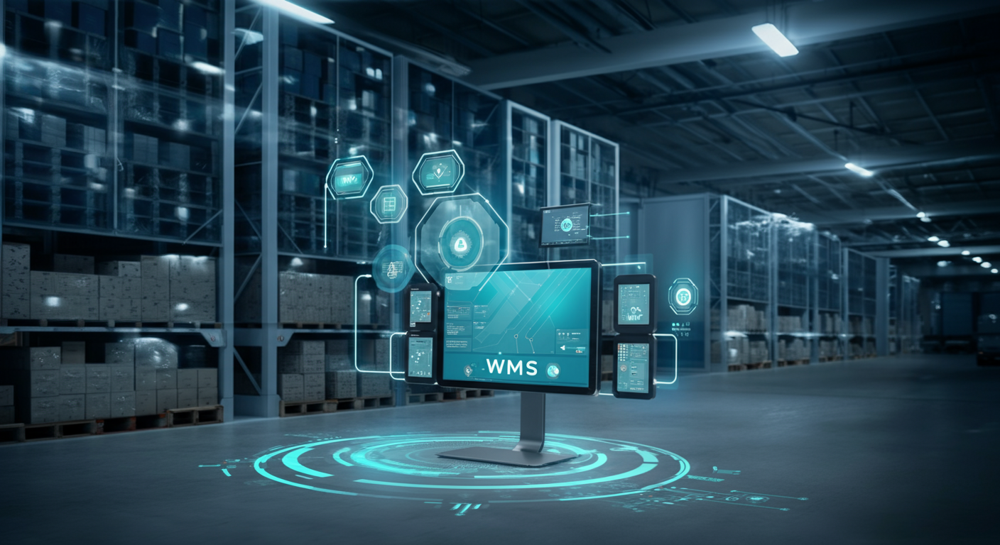

物流業界は、EC市場の拡大、人手不足、そして「2024年問題」といった数々の課題に直面しています。これらの課題を克服し、競争力を維持・強化するための鍵となるのが、倉庫内業務の効率化と精度向上を実現するWMS（Warehouse Management System：倉庫管理システム）の導入です。

しかし、市場には多種多様なWMSが存在し、「どのツールが自社に合っているのか分からない」という声は少なくありません。WMS選定の失敗は、高額な投資の無駄遣いだけでなく、現場の混乱やDX推進の停滞を招くリスクもはらんでいます。

本記事では、これからWMSの導入を検討する経営層やIT担当者の皆様に向けて、失敗しないための比較ポイント、主要なシステムのタイプ、そして自社に最適なツールを見つけるための具体的なステップを分かりやすく解説します。

## 比較の5大ポイント：WMS選定で失敗しないための基準

WMSを比較検討する際には、以下の5つのポイントを総合的に評価することが重要です。

### 1. 機能：自社の業務フローに適合しているか
最も重要なのは、自社の業務要件を満たす機能が備わっているかです。まずは必須機能と、将来的に必要となりそうな拡張機能を洗い出しましょう。

- **基本機能**: 在庫管理、入荷管理、出荷管理、棚卸管理、ロケーション管理、帳票発行など。
- **応用機能**: ハンディターミナルやマテハン機器との連携、複数拠点の一元管理、分析・レポート機能、賞味期限やロット管理など。
- **業種特化機能**: アパレル（SKU管理）、食品（温度帯管理）、EC（ギフト対応や同梱処理）、3PL（荷主ごとの管理）など、自社の業界特有の要件に対応できるかも確認が必要です。

### 2. コスト：初期費用とランニングコストのバランス
コストは「初期費用」と「月額（年額）のランニングコスト」の2軸で評価します。

- **初期費用**: システム導入費、ライセンス費、カスタマイズ費、機器購入費（PC、ハンディターミナルなど）、導入コンサルティング費。
- **ランニングコスト**: システム利用料（月額）、サーバー維持費、保守・サポート費用。

安さだけで選ぶのではなく、機能やサポート内容との費用対効果を冷静に判断しましょう。

### 3. 提供形態：クラウド型かオンプレミス型か
WMSの提供形態は、大きく分けて「クラウド型」と「オンプレミス型」があります。それぞれにメリット・デメリットがあり、自社のIT方針やセキュリティ要件に合わせて選択する必要があります。

- **クラウド型**: インターネット経由でサービスを利用する形態。サーバー管理が不要で、比較的低コストかつ短期間で導入できます。
- **オンプレミス型**: 自社内にサーバーを設置してシステムを構築・運用する形態。カスタマイズ性が高く、自社のセキュリティポリシーに準拠させやすいのが特徴です。

### 4. サポート体制：導入後も安心して運用できるか
導入はゴールではありません。システムを安定稼働させ、現場で使いこなすためには、提供ベンダーのサポート体制が不可欠です。

- **導入支援**: 業務フローのヒアリング、データ移行支援、操作トレーニングなどの充実度。
- **運用保守**: 問い合わせ対応の時間帯や方法（電話、メール、チャット）、トラブル発生時の対応スピード、定期的なアップデートの有無などを確認しましょう。

### 5. 連携性：既存システムとスムーズに繋がるか
WMSは単体で完結するものではなく、基幹システム（ERP）、販売管理システム、ECカートシステム、配送管理システム（TMS）など、様々な外部システムとの連携が求められます。API連携の柔軟性や、主要なシステムとの連携実績があるかを確認することが重要です。

## WMSの主要タイプと特徴

市場にあるWMSは、主に以下の3つのタイプに分類できます。それぞれの特徴を理解し、自社の規模や目的に合ったタイプを見極めましょう。

| タイプ | 主な特徴 |
| :--- | :--- |
| **クラウド型** | 月額費用で利用できるサブスクリプションモデルが主流。サーバー管理が不要で、スピーディかつ低コストで導入可能。機能は標準化されていることが多いが、近年はオプションも豊富。 |
| **パッケージ型** | 買い切りまたはライセンス形式で提供されるソフトウェア。豊富な標準機能を持ち、業界・業種別のテンプレートが用意されていることも多い。必要に応じてカスタマイズも可能。 |
| **オンプレミス型（フルスクラッチ）** | 自社の要件に合わせてゼロからシステムを開発・構築する形態。極めて高いカスタマイズ性を誇るが、開発費用と期間は最も大きくなる。自社サーバーでの運用が基本。 |

## 【タイプ別】メリット・デメリット比較表

各タイプの長所と短所を理解することで、自社にとってのリスクとリターンを把握できます。

| タイプ | メリット | デメリット | 向いている企業 |
| :--- | :--- | :--- | :--- |
| **クラウド型** | 初期費用が安く、導入までの期間が短い。サーバーの管理が不要で、法改正や機能アップデートが自動で行われる。場所を問わずアクセスできる。 | ランニングコストが継続的に発生する。標準機能が中心で、大幅なカスタマイズは難しい場合が多い。セキュリティポリシーが提供ベンダーに依存する。 | 中小企業、EC事業者、スタートアップ。まずはスモールスタートしたい企業。複数拠点への迅速な展開を求める企業。 |
| **パッケージ型** | 業界標準の業務ノウハウが詰まった豊富な機能を利用できる。クラウド型に比べてカスタマイズの自由度が高い。導入実績が多く、信頼性が高い。 | クラウド型よりも初期費用が高額になる傾向がある。導入に一定の期間を要する。自社の特殊な業務フローに完全に合致しない場合がある。 | 中堅企業、特定の業界（3PL、製造業など）で標準的な業務を行っている企業。ある程度の自社要件に合わせた調整をしたい企業。 |
| **オンプレミス型（フルスクラッチ）** | 自社の独自の業務フローに完全に適合したシステムを構築できる。既存システムとの連携やセキュリティ要件に柔軟に対応可能。 | 開発費用と期間が膨大になる。サーバーの購入・維持管理コストや専門知識を持つ人材が必要。将来の法改正やOSアップデートに自社で対応する必要がある。 | 大企業、特殊な商品（医薬品、危険物など）を扱い独自の管理が必要な企業。非常に高いセキュリティレベルが求められる企業。 |

## 自社に最適なWMSを見つけるための5ステップ

最後に、具体的なWMS選定プロセスを5つのステップでご紹介します。

### Step 1: 現状課題と導入目的の明確化
まず、「なぜWMSを導入するのか」を具体的に定義します。「出荷ミス率を5%から0.5%に削減する」「ピッキング作業時間を20%短縮する」など、数値目標（KPI）を設定することで、選定の軸がブレなくなります。現場の担当者からヒアリングを行い、現状の課題を洗い出しましょう。

### Step 2: 予算と要件定義
導入目的と課題を基に、必要な機能を「必須（Must）」「できれば欲しい（Want）」に分けてリストアップします（要件定義）。同時に、捻出できる予算（初期費用とランニングコスト）の上限を明確にしておきます。

### Step 3: 複数サービスのリストアップと比較
本記事の比較表などを参考に、自社の規模、業種、要件に合いそうなWMSを3〜5社程度に絞り込みます。各社のウェブサイトや資料請求で情報を集め、機能や価格、導入事例を比較検討します。

### Step 4: デモやトライアルで操作性を確認
候補を絞り込んだら、必ずデモや無料トライアルを申し込みましょう。実際にシステムを操作することで、使いやすさや画面の見やすさを確認できます。この際、実際にシステムを利用する現場担当者にも参加してもらうことが極めて重要です。

### Step 5: 見積もり取得と最終選定
最終候補の数社から詳細な見積もりを取得し、費用対効果を最終評価します。機能やコストだけでなく、ベンダーのサポート体制、将来性、担当者との相性なども含めて総合的に判断し、導入するWMSを決定します。

WMSは一度導入すると長く付き合うことになる重要な経営基盤です。焦らず、慎重に、自社の未来を共に創るパートナーを選ぶという視点で選定を進めていきましょう。
