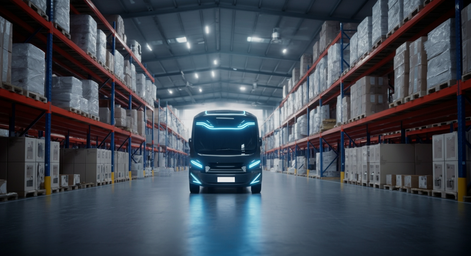

「人手が足りず、出荷が間に合わない…」
「広大な倉庫内を歩き回るだけで、1日が終わってしまう…」
「ECの多品種小ロット化で、ピッキング作業がどんどん複雑になっている…」

物流の現場で働く担当者や倉庫管理者の皆様であれば、このような課題に日々頭を悩ませているのではないでしょうか。特に、2024年問題や労働人口の減少は、物流業界全体にとって待ったなしの状況です。

こうした深刻な課題を解決する切り札として、今、大きな注目を集めているのが**「自動搬送ロボット」**です。

この記事では、物流DXの重要な要素である自動搬送ロボットについて、その基礎知識から導入のメリット、そして事前に知っておくべき注意点まで、分かりやすく解説していきます。自社の倉庫にどんな可能性があるのか、未来を想像しながら読み進めてみてください。

## 基礎知識：自動搬送ロボットとは？

自動搬送ロボットとは、その名の通り**「人や障害物を自律的に避けながら、荷物を目的地まで自動で運ぶロボット」**のことです。

これまでの倉庫作業では、作業員が伝票を片手に広大な倉庫を歩き回り、商品を探し、台車で運ぶという「歩行」に多くの時間が費やされていました。自動搬送ロボットは、この「運ぶ」という作業を人に代わって担ってくれる、頼もしいパートナーです。

### 「AGV」と何が違うの？

自動搬送ロボットの話をすると、必ずと言っていいほど出てくるのが「AGV」という言葉です。両者は混同されがちですが、その仕組みには大きな違いがあります。近年注目されているのは、より賢く、柔軟な「AMR」タイプです。

| 項目 | AGV (無人搬送車) | AMR (自律走行搬送ロボット) |
| :--- | :--- | :--- |
| **正式名称** | Automated Guided Vehicle | Autonomous Mobile Robot |
| **走行方法** | 床に貼られた磁気テープやQRコードなどの誘導体に沿って走行する。決められたルートしか走れない。 | 自身で倉庫のマップを作成し、人や障害物を避けながら最適なルートを判断して自律走行する。 |
| **柔軟性** | 低い。ルート変更にはテープの貼り替えなど物理的な工事が必要で、時間とコストがかかる。 | 非常に高い。ソフトウェア上で簡単にルート変更が可能。繁忙期など状況に応じた柔軟な対応ができる。 |
| **導入障壁** | 比較的低いが、床工事が必要な場合がある。 | ソフトウェア設定が中心。物理的な工事は基本的に不要で、導入期間が短い傾向にある。 |
| **得意なこと** | 決まった場所への単純な往復搬送。生産ラインなど。 | 複雑な動きが求められる倉庫内ピッキング。人と協働する作業。 |

簡単に言えば、AGVが「線路の上を走る電車」なら、AMRは「自分で道を判断して走るタクシー」のようなものです。現在の物流倉庫で求められる柔軟性から、**AMR型の自動搬送ロボット**が主流となりつつあります。

### どうやって動いているの？

AMR型のロボットは、主に「SLAM（スラム）」と呼ばれる技術を使って、賢く倉庫内を動き回ります。

*   **SLAM (Simultaneous Localization and Mapping)**
    これは、ロボットが搭載しているセンサー（カメラやLiDARなど）で周囲の状況を把握し、「自分が今どこにいるか（自己位置推定）」と「周囲の地図（環境地図作成）」を同時に行う技術です。まるで初めて訪れた街を歩きながら、頭の中に地図を描いていくようなイメージです。これにより、事前の大掛かりな工事なしで、自律走行が可能になります。

さらに、倉庫管理システム（WMS）など上位のシステムと連携し、「どの商品を、どこからどこへ運ぶか」という指示を受け、複数のロボットが互いにぶつからないように協調しながら、効率的に作業を実行します。

## メリット・重要性：自動搬送ロボットがもたらす変革

自動搬送ロボットを導入することで、倉庫の現場はどのように変わるのでしょうか。そのメリットは多岐にわたります。

### 1. 生産性の劇的な向上
ピッキング作業において、作業時間の半分以上は「歩行」に費やされていると言われます。ロボットがこの歩行を代行することで、作業員は商品の棚入れや棚出しといった付加価値の高い作業に集中できます。結果として、1人あたりの生産性は2倍、3倍にも向上する可能性があります。また、ロボットは24時間365日稼働できるため、夜間や休日も倉庫を動かし続けることが可能です。

### 2. 人手不足の解消と働き方改革
慢性的な人手不足は、物流業界最大の課題です。ロボット導入は、省人化に直接貢献します。また、重い荷物を運んだり、長距離を歩いたりといった身体的負担の大きい作業がなくなるため、高齢者や女性も働きやすい環境が実現します。作業が標準化されることで、新人でもすぐに即戦力となれる点も大きなメリットです。

### 3. ヒューマンエラーの削減と品質向上
「違う商品をピッキングしてしまった」「数量を間違えた」といったヒューマンエラーは、誤出荷に繋がり、顧客満足度の低下や返品対応コストの発生を招きます。ロボットはシステムからの指示に基づき、正確に作業を遂行するため、こうした人為的ミスを限りなくゼロに近づけることができます。

### 4. 柔軟なレイアウト変更への対応
ECのセール時期や季節商材の入れ替えなど、物流波動に応じて倉庫のレイアウトを変更したいケースは頻繁にあります。誘導体が必要なAGVでは対応が困難でしたが、AMRであればソフトウェアの設定変更だけで簡単かつ迅速に対応できます。ビジネスの変化に強い、しなやかな倉庫運営が実現します。

## 注意点・課題：導入前に知っておくべきこと

多くのメリットがある一方で、自動搬送ロボットの導入は「入れれば終わり」ではありません。成功のためには、いくつかの注意点を理解しておく必要があります。

| 注意点・課題 | 対策と検討事項 |
| :--- | :--- |
| **導入コスト** | 初期投資は決して安価ではありません。投資対効果（ROI）を事前にしっかりと試算することが重要です。近年は月額料金で利用できる「RaaS（Robot as a Service）」モデルも増えているため、選択肢として検討しましょう。 |
| **既存システムとの連携** | ロボットを効率的に動かすには、倉庫管理システム（WMS）との連携が不可欠です。自社のWMSがロボット連携に対応しているか、改修にどれくらいの費用と期間がかかるかを事前に確認する必要があります。 |
| **現場環境の整備** | ロボットがスムーズに走行できるよう、床面の段差や傾斜を解消する必要があります。また、安定したWi-Fi環境の構築も必須です。ロボットが通れる通路幅が確保されているかも確認しましょう。 |
| **運用ルールの策定** | 人とロボットが安全に共存するためのルール作りが重要です。ロボットの走行エリアと人の作業エリアを分ける、緊急停止時の対応フローを決める、定期的なメンテナンス計画を立てるなど、詳細な運用設計が求められます。 |
| **現場の心理的ハードル** | 「ロボットに仕事を奪われるのではないか」という現場作業員の不安に配慮する必要があります。導入の目的を丁寧に説明し、ロボットは人の仕事を補助するパートナーであること、人はより創造的な仕事にシフトできることなどを伝え、理解を得ることが成功の鍵です。 |

## まとめ：未来の倉庫への第一歩を踏み出そう

自動搬送ロボットは、もはやSFの世界の話ではなく、物流現場の課題を解決する現実的なソリューションです。導入すれば、人手不足の解消、生産性の向上、働きやすい環境の実現など、計り知れない恩恵をもたらしてくれます。

しかし、それは魔法の杖ではありません。自社の課題を正しく認識し、適切な準備と運用設計を行ってこそ、その真価を発揮します。

この記事を読んで自動搬送ロボットに興味を持たれたなら、次のアクションを起こしてみてはいかがでしょうか。

1.  **自社の倉庫作業を分析し、どこにボトルネックがあるのかを洗い出す。**
2.  **各ロボットメーカーのWebサイトや導入事例を調べ、情報収集を行う。**
3.  **展示会やセミナーに参加し、実際に動いているロボットを見てみる。**
4.  **専門家やベンダーに相談し、自社の課題に合った提案を受けてみる。**

未来の物流を支えるのは、人とテクノロジーが協働する新しい姿です。この記事が、貴社の物流DXを加速させるための一助となれば幸いです。
