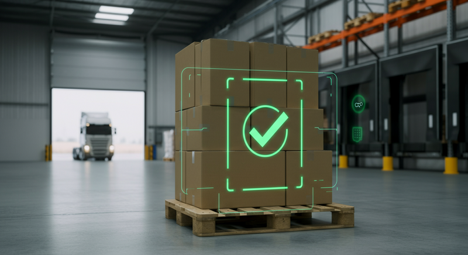

物流業界の皆様、日々の業務お疲れ様です。LogiShift編集部です。今回は、物流DXの新たな潮流として注目される「Featured Image Verification」について、その概要と業界へのインパクトを速報としてお届けします。

### 1. ニュース概要: 今、何が起きているのか

置き配の完了報告、トラックへの積載証明、貨物の状態確認など、物流現場ではスマートフォン等で写真を撮影し、エビデンス（証拠）として残す業務が一般化しています。しかし、その膨大な数の画像を「人間の目」で一枚一枚確認する作業は、管理者の大きな負担となり、見落としなどのヒューマンエラーの原因にもなっていました。

この課題を解決する技術として急速に普及し始めているのが、AI画像認識を活用した**「Featured Image Verification（フィーチャード・イメージ・ベリフィケーション）」**です。

これは、配送プロセスにおける特定の重要な場面（Featured）で撮影された画像（Image）を、AIが自動で解析し、その内容が正しいかどうかを検証（Verification）する仕組みを指します。例えば、「置き配の写真が、本当に玄関前に安全に置かれているか」「積載された荷物に偏りや破損がないか」などを瞬時に判定します。

### 2. 業界への影響: 物流品質と生産性の劇的な向上

Featured Image Verificationの導入は、物流現場に多岐にわたるポジティブな影響をもたらします。従来の手法と比較してみましょう。

| 項目 | 従来の方法（目視確認） | Featured Image Verification導入後 |
| :--- | :--- | :--- |
| 配送完了確認 | 管理者による写真の目視チェック。確認漏れのリスク。 | AIによる自動判定。異常時のみアラート通知。 |
| 積載状態確認 | ドライバーの経験則に依存。写真での事後確認は困難。 | AIが積載率や荷崩れリスクを解析・警告。 |
| 破損検知 | 作業員の目視で発見。見落としや責任所在が不明確に。 | AIが破損箇所を自動検知・記録。客観的証拠を確保。 |
| 作業負荷 | 確認作業に膨大な時間。管理者の負担増。 | 確認作業の自動化。管理者はコア業務に集中。 |

この技術により、以下のインパクトが期待されます。

*   **配送品質の標準化**: AIによる客観的な判定で、ドライバー個人のスキルに依存しない、安定したサービス品質を実現します。不適切な置き配などを未然に防ぎ、顧客満足度を向上させます。
*   **生産性の飛躍的向上**: 管理者は「異常があった画像」のみを確認すればよいため、確認作業にかかる時間を90%以上削減できるケースも報告されています。
*   **迅速なトラブル対応**: 荷物紛失や破損に関する問い合わせに対し、AIの解析結果を含む客観的なデータを即座に提示可能に。これにより、円滑な顧客対応と、不正なクレームの抑止に繋がります。

### 3. LogiShiftの視点: 「検証」から「予測・最適化」へ

この技術のポテンシャルは、単なる「事後確認の自動化」に留まりません。私たちは、今後さらに進化していくと予測しています。

**今後の展開予測**
*   **予測分析への応用**: 蓄積された膨大な画像データを分析し、「この積み方では輸送中に荷崩れが発生する確率が80%」といったリスクをリアルタイムで予測・警告する。
*   **ドライバー教育への活用**: 各ドライバーの積載や配送完了写真の傾向を分析し、個別の改善点をフィードバックする教育ツールとしての活用。
*   **保険・金融との連携**: AIによる検証済みの高品質なエビデンスがある運送会社に対し、貨物保険料を割り引くといった、新たな金融サービスが登場する可能性があります。

Featured Image Verificationは、これまで感覚的に行われてきた業務をデータ化・可視化し、物流現場をより科学的なアプローチへと変革させる起爆剤となるでしょう。

### 4. まとめ: 企業はどう備えるべきか

2024年問題に直面する物流業界にとって、生産性向上は待ったなしの課題です。Featured Image Verificationは、その有力な解決策の一つとなり得ます。

では、企業は今からどう備えるべきでしょうか。

1.  **課題の明確化**: まずは自社のどの業務プロセスで画像によるエビデンス管理を行っており、そこにどのような課題（時間、コスト、ミス）があるかを洗い出しましょう。
2.  **スモールスタートの検討**: 全社一斉導入ではなく、特定の拠点や配送ルートで試験的に導入し、費用対効果を検証することから始めるのが現実的です。
3.  **現場との対話**: この技術は「監視ツール」ではなく、現場の負担を減らし、安全を守るための「支援ツール」です。導入の目的を丁寧に説明し、現場の協力を得ることが成功の鍵となります。

テクノロジーの進化は、時に現場のオペレーションを根底から変えます。この新しい波に乗り遅れることなく、自社の競争力強化に繋げていく視点が、これからの物流企業には不可欠です。
