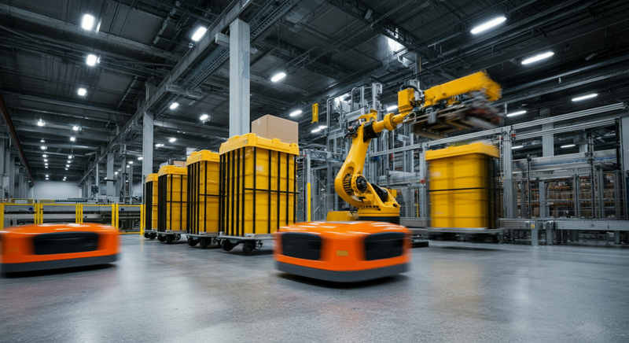

EC市場の拡大に伴う物量の増加と、世界的な労働力不足。この二つの大きな課題に直面する物流業界では、「倉庫自動化」が経営戦略の根幹をなすテーマとなっています。特にその最前線を走るのが、アメリカの巨大企業Amazonです。同社はロボット技術を駆使し、倉庫オペレーションのあり方を根本から変えようとしています。

本記事では、イノベーションを求める経営層や新規事業担当者の皆様に向けて、Amazonを中心とした海外の倉庫自動化の最新動向と先進事例を解説し、そこから日本企業が得られるべき示唆を探ります。

### 1. 海外の動向：米・中・欧で加速する自動化競争

倉庫自動化の波は世界中で起きていますが、そのアプローチは地域によって異なります。アメリカがEC主導で進化を続ける一方、中国は国家戦略として、欧州は製造業との連携の中で独自の発展を遂げています。

| 地域 | 主なプレイヤー | 特徴 |
|---|---|---|
| アメリカ | Amazon, Walmart, スタートアップ多数 | EC主導のスケールメリット追求、AI活用による高度化、RaaSモデルの普及 |
| 中国 | Alibaba, JD.com, Geek+ | 政府主導の急速な大規模導入、低コストロボットの世界展開 |
| 欧州 | DHL, Zalando, AutoStore | 製造業連携（インダストリー4.0）、高密度保管、サステナビリティ重視 |

アメリカでは、Amazonが2012年にKiva Systemsを買収して以来、GTP（Goods to Person：棚が人の元へ移動する方式）ロボットの活用をリードしてきました。現在では、より柔軟なAMR（自律走行搬送ロボット）やAIピッキングロボットへと技術の軸足を移し、スタートアップも次々と新たなソリューションを市場に投入しています。

一方、中国ではAlibabaやJD.comといったECジャイアントが、桁違いの物量を捌くために「無人倉庫」に近いレベルの大規模自動化を推進。Geek+（ギークプラス）に代表される国内ロボットメーカーが急成長し、コスト競争力を武器に世界市場へ進出しています。

### 2. 先進事例：Amazonが描く次世代倉庫と注目スタートアップ

海外の先進事例を見ると、倉庫自動化が新たなフェーズに入ったことが分かります。特に注目すべきは、単体のロボット導入ではなく、プロセス全体を最適化するシステムとしての取り組みです。

#### Amazonの最新ロボット技術

Amazonは、人とロボットがよりシームレスに協働する未来を目指し、次々と革新的な技術を自社開発しています。その多くは、まだ日本に本格上陸していない概念です。

*   **Proteus（プロテウス）**: Amazon初の完全自律走行搬送ロボット（AMR）。従来のAGV（無人搬送車）と異なり、決められた経路上だけでなく、人や障害物を避けながら施設内を自由に移動できます。これにより、人とロボットの作業エリアを完全に分離する必要がなくなり、より柔軟なレイアウトとオペレーションが実現します。
*   **Sparrow（スパロー）**: AIとコンピュータービジョンを駆使した最新のロボットアーム。Amazonが取り扱う数百万種類もの商品を個別に認識し、繊細な力加減でピッキング（商品を掴み取ること）が可能です。これは従来のロボットが苦手としてきた「ピースピッキング」の自動化を大きく前進させる技術です。
*   **Sequoia（セコイア）**: 上記のロボット技術を統合した、全く新しい倉庫システムです。入荷した商品をコンテナ単位で管理し、ロボットが保管棚まで自動搬送。注文が入ると、必要な商品コンテナがピッキングステーションへ運ばれ、作業員やロボットが商品を取り出します。これにより、**顧客への注文から出荷までの時間を最大25%短縮**できるとされています。

これらの技術は、「ロボットに作業を置き換えてもらう」という発想から、「ロボットと共にプロセス全体を再設計する」という思想への転換を示唆しています。

#### その他の先進企業

| 企業名 (国) | 主な技術/ソリューション | 特徴 |
|---|---|---|
| Locus Robotics (米) | 協働型AMR | RaaS（Robot as a Service）モデルで提供。人が歩く距離を最小化し、生産性を2〜3倍に向上させる。 |
| Berkshire Grey (米) | AIロボットピッキングシステム | 小売、EC、小包物流向けに、複雑なピッキング・仕分け作業を自動化するソリューションを提供。 |
| Exotec (仏) | Skypodシステム | 3次元で走行するロボットが高密度な棚から商品を取り出すGTP。省スペースと高い処理能力を両立。 |

特にLocus Roboticsが提供するRaaSモデルは、多額の初期投資を必要とせず、月額料金でロボットを利用できるため、中小規模の倉庫でも導入のハードルが低いのが特徴です。

### 3. 日本への示唆：海外トレンドから何を学ぶべきか

これらの海外事例は、日本の物流企業にとって多くの示唆を与えてくれます。

1.  **「全体最適」の視点を持つ**
    AmazonのSequoiaシステムが示すように、もはや「搬送だけ」「ピッキングだけ」といった部分的な自動化では競争優位を築けません。入荷、保管、ピッキング、仕分け、梱包、出荷という一連のプロセスをデータで繋ぎ、全体としてどう効率化するかという視点が不可欠です。WMS（倉庫管理システム）とWES（倉庫実行システム）を連携させ、ロボットを最適に制御する「頭脳」への投資が重要になります。

2.  **人とロボットの新たな協働関係を築く**
    完全無人化を目指すのではなく、人とロボットの得意分野を活かした役割分担を設計することが現実的です。ロボットが単調で身体的負担の大きい作業を担い、人はイレギュラー対応、品質管理、改善活動といった、より付加価値の高い業務に集中する。これにより、従業員の労働環境改善と生産性向上を両立できます。

3.  **スモールスタートとデータ活用を前提とする**
    いきなり大規模な自動化投資に踏み切る必要はありません。RaaSモデルなどを活用して特定エリアやプロセスからスモールスタートし、そこで得られたデータを分析して効果を検証しながら、段階的に適用範囲を広げていくアプローチが有効です。重要なのは、導入して終わりではなく、データを活用して継続的にオペレーションを改善していく文化を醸成することです。

### 4. まとめ：未来の倉庫は「インテリジェント」な協働空間へ

アメリカのAmazonを筆頭とする海外の倉庫自動化は、単なる省人化ツールから、サプライチェーン全体の競争力を左右する戦略的基盤へと進化しています。未来の倉庫は、単に機械が動く場所ではなく、人とロボット、そしてAIが連携し、リアルタイムのデータに基づいて自己最適化していく「インテリジェントな協働空間」となるでしょう。

日本の経営層に求められるのは、この大きな変化を脅威ではなくチャンスと捉え、自社の強みと現場の知見を活かした独自の自動化戦略を描き、実行に移す勇気です。海外の最前線に学びながらも、日本ならではのきめ細やかなオペレーションと融合させることで、世界に伍する次世代の物流を創造できるはずです。
