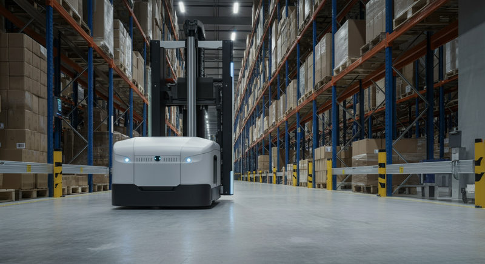

EC市場の急拡大と深刻化する労働力不足。この二つの大きな潮流は、世界の物流業界に構造変革を迫っています。特に、サプライチェーンの要である倉庫業務の効率化は喫緊の課題であり、その解決策として「物流ロボット」への期待がかつてないほど高まっています。

中でもアメリカ市場は、革新的なスタートアップが次々と登場し、物流ロボット技術の実証実験と社会実装をリードする最前線となっています。本記事では、イノベーションを求める経営層や新規事業担当者の皆様に向けて、アメリカを中心とした物流ロボットの海外最新動向を解説し、日本企業が取るべき戦略のヒントを提示します。

### 1. 海外の動向: 米国・中国・欧州で何が起きているか

物流ロボット市場は、地域ごとに異なる特徴を持って発展しています。アメリカがスタートアップ主導のイノベーション拠点である一方、中国は政府と巨大EC企業が牽引し、欧州は堅実な技術を着実に進化させています。

| 地域 | 特徴 | 主要プレイヤー/技術 |
| :--- | :--- | :--- |
| **米国** | スタートアップ主導のイノベーション。RaaSモデルが主流。多様なロボットの実証実験が活発。 | Amazon Robotics, Locus Robotics (AMR), Boston Dynamics (AGV/Humanoid), Berkshire Grey (AIピッキング) |
| **中国** | 政府主導の産業育成と大規模投資。ECジャイアントによる自社物流網への大量導入。 | Geek+ (AMR), HAI ROBOTICS (ACR), JD.com, Alibaba (Cainiao) |
| **欧州** | 成熟したAGV市場と製造業との連携。労働環境との調和やサステナビリティを重視。 | AutoStore (GTP), Swisslog, Knapp AG, Exotec (Skypod) |

アメリカ市場の特筆すべき点は、**RaaS（Robotics as a Service）**というビジネスモデルが広く普及していることです。これは、ロボットを買い取るのではなく、月額利用料を支払うサブスクリプション型のサービスです。企業は初期投資を大幅に抑制でき、物量の変動に応じてロボットの台数を柔軟に調整できるため、中小企業でも最先端の自動化技術を導入しやすくなっています。

### 2. 先進事例: アメリカの注目企業と日本未上陸の技術

アメリカの物流ロボット市場を牽引する、具体的な企業の取り組みを見ていきましょう。

#### Amazon Robotics: 倉庫自動化のゲームチェンジャー
2012年にKiva Systemsを買収して設立されたAmazon Roboticsは、棚ごと商品をピッキング担当者の元へ運ぶ**GTP（Goods-to-Person）**方式を確立しました。この技術は倉庫内での歩行時間を劇的に削減し、生産性を飛躍的に向上させました。現在は、AIを活用してアイテムを個別に認識し掴み取るピッキングロボット「Sparrow」や、人や障害物を避けながら自律的に荷物を運ぶ搬送ロボット「Proteus」など、さらなる自動化領域の拡大を進めています。

#### Locus Robotics: 人と協働するAMRの旗手
AmazonがGTPを自社で独占した後、市場には新たなソリューションが求められました。そこで台頭したのが、**AMR（Autonomous Mobile Robot: 自律走行搬送ロボット）**を手掛けるLocus Roboticsです。Locusのロボットは、作業者がいる場所まで自律的に移動し、ピッキングする商品を指示。作業者が商品をロボットに乗せると、ロボットは次の目的地や梱包エリアへ自動で向かいます。既存の倉庫レイアウトを大きく変更することなく導入でき、RaaSモデルで提供されるため、多くの3PL（サードパーティ・ロジスティクス）企業に採用されています。

#### Boston Dynamics: 「荷下ろし」を自動化するStretch
四足歩行ロボット「Spot」で有名なBoston Dynamicsは、物流業界向けに特化したAGV（無人搬送車）「**Stretch**」を開発しました。Stretchの最大の特徴は、トラックやコンテナからの**荷下ろし（デバンニング）**作業を自動化できる点です。強力な吸着アームと高度なコンピュータービジョンを駆使し、大きさや形状が異なる様々な段ボール箱を高速で移動させます。これまで自動化が困難とされてきた不定形物のハンドリングに挑む、まさに日本未上陸の先進技術です。

### 3. 日本への示唆: 日本の物流企業はどう活かすべきか

アメリカの先進事例は、日本の物流企業に多くのヒントを与えてくれます。

#### ① 「完全自動化」から「人間協働・部分最適」へ
日本では「自動化＝無人化」というイメージが強いですが、アメリカではまず人とロボットが協働し、ボトルネックとなっている工程を部分的に自動化するアプローチが主流です。Locus RoboticsのAMRのように、既存のオペレーションに後付けで導入できるソリューションは、投資対効果を見極めながらスモールスタートで自動化を進めたい日本企業にとって有効な選択肢となります。

#### ② RaaSモデルの積極的な検討
労働力人口が減少する日本では、物量波動への対応がますます困難になります。RaaSモデルを活用すれば、繁忙期だけロボットを増やすといった柔軟なリソース配分が可能になります。初期投資を抑え、最新技術を「サービス」として利用する発想の転換が、競争力を維持する上で不可欠です。

#### ③ データドリブンな倉庫運営へのシフト
物流ロボットの導入は、単なる省人化ツールではありません。ロボットが収集する走行ルート、作業時間、ピッキング頻度といった膨大なデータは、倉庫運営を最適化するための貴重な資産です。これらのデータを分析し、倉庫レイアウトの改善や SKU（在庫保管単位）の配置見直し、人員配置の最適化に繋げる「データドリブンな意思決定」が、次のレベルの効率化を実現します。

### 4. まとめ: 未来の物流をデザインする戦略的投資へ

アメリカの物流ロボット市場は、AI、ビジョン技術、そして革新的なビジネスモデルを融合させながら、かつてSFの世界だった光景を次々と現実のものにしています。今後、ロボットはさらに知能化し、人間とのコミュニケーション能力も向上していくでしょう。

日本の物流企業にとって、物流ロボットはもはや単なるコスト削減策ではありません。それは、サプライチェーンのレジリエンス（強靭性）を高め、新たな付加価値を創出するための「戦略的投資」です。海外のトレンドを注意深く観察し、自社の課題解決に繋がる技術やサービスを積極的に取り入れる姿勢こそが、不確実な未来を乗り越え、持続的な成長を遂げるための鍵となるのです。
