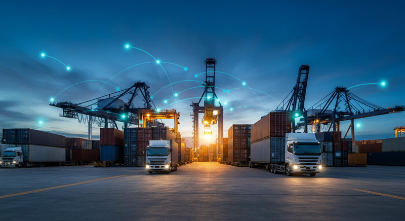

これまで「個社最適」の壁に阻まれがちだったサプライチェーンの最適化が、新たなステージへと突入する可能性が出てきました。富士通が開発した「マルチAIエージェント連携技術」は、企業やシステムの壁を越え、サプライチェーン全体の最適化を実現する画期的な一手となるかもしれません。本記事では、この最新技術の概要と、物流業界に与えるインパクトを速報的に解説します。

### 1. ニュース概要：何が起きているのか

富士通は2024年6月、サプライチェーンに関わる複数の企業が持つ、異なるベンダー製のAIエージェント同士を連携させ、全体最適化を図る「マルチAIエージェント連携技術」を開発したと発表しました。

これまでのサプライチェーン管理では、各企業が自社の利益や効率を最大化する「個社最適」に留まることが多く、チェーン全体で見た場合の非効率や機会損失が発生していました。今回の技術は、この課題を解決することを目的としています。

技術のポイントは、限られた情報共有の中でもAI同士が指示や交渉を行い全体最適を導き出す「不完全情報下でのAIエージェント全体最適制御」と、企業間の安全な情報連携を担保する「セキュアエージェントゲートウェイ」の2つです。これにより、平時の効率化はもちろん、需要の急増や災害発生時といった不測の事態にも迅速に対応できる、しなやかなサプライチェーンの構築を目指します。

以下に本ニュースの要点をまとめました。

| 項目 | 内容 |
|:---|:---|
| 開発企業 | 富士通株式会社 |
| 技術名称 | マルチAIエージェント連携技術 |
| 主要技術 | 不完全情報下でのAIエージェント全体最適制御、セキュアエージェントゲートウェイ |
| 特徴 | 異なる企業・ベンダーのAIを連携。限られた情報でサプライチェーン全体を最適化。通常時の効率化と緊急時の迅速な回復を実現。 |
| 実証実験 | 2026年1月より東京科学大学、ロート製薬と開始予定 |

### 2. 業界への影響：物流DXの新次元へ

この技術が物流業界に与えるインパクトは計り知れません。特に以下の2点で、既存の物流DXの常識を覆す可能性があります。

**①「個社最適」から「全体最適」への本格シフト**
メーカー、卸、小売、そして物流事業者。それぞれが持つ在庫情報や生産計画、配送計画は、これまで十分に連携されてきませんでした。本技術は、各社が機密情報をすべて開示することなく、AIエージェントを介して協調動作を可能にします。これにより、例えば「メーカーの急な増産計画」を「物流事業者の配車計画」や「小売の在庫計画」にリアルタイムで反映し、チェーン全体の欠品や過剰在庫を抑制できます。これは、まさにサプライチェーンの理想形です。

**②レジリエンス（回復力）の飛躍的向上**
自然災害やパンデミックによるサプライチェーンの寸断は、多くの企業にとって深刻な経営課題です。本技術は、一部の拠点が機能不全に陥った際、他の拠点のAIエージェントが連携して代替ルートや代替生産計画を自律的に再構築することを可能にします。これにより、BCP（事業継続計画）の実効性が格段に高まり、有事の際の迅速な事業回復が期待できます。

### 3. LogiShiftの視点：業界の「協調領域」を創出するゲームチェンジャー

我々は、この「マルチAIエージェント連携技術」を、単なる新技術ではなく、物流業界の構造変革を促すゲームチェンジャーと捉えています。

ポイントは、**限られた情報下でも連携できる**という点です。サプライヤーが何層にも連なる日本の複雑なサプライチェーン構造において、全企業がオープンにデータを共有することは現実的ではありません。本技術は、その現実を踏まえた上で「全体最適」というゴールを目指せる、極めて実践的なアプローチと言えるでしょう。

富士通が構想する、様々なAIが協調動作する空間「AIスペース」は、将来的に業界標準のデータ連携基盤となるポテンシャルを秘めています。これは、各社が独自に競い合う「競争領域」とは別に、業界全体で効率化を追求する「協調領域」をテクノロジーによって創り出す試みです。この流れが加速すれば、日本のサプライチェーン全体の国際競争力強化に直結することは間違いありません。

今こそ、自社の効率化だけでなく、サプライヤーや物流パートナーといった関係各社との「AIによる連携」を真剣に検討すべき時です。未来の物流は、個々の力ではなく、連携する力によって創られます。

### 4. まとめ：企業はどう備えるべきか

2026年の実証実験開始までまだ時間はありますが、来るべき「全体最適」の時代に乗り遅れないために、企業は今から準備を始めるべきです。

まずは、自社の輸配送、在庫、生産といった各業務領域で、どのようなデータが取得でき、AIでどう活用できるのかを棚卸しすることから始めましょう。その上で、サプライチェーン上のパートナー企業と、どのようなデータ連携が可能か、どのような共通課題があるかについて対話を開始することが重要です。

富士通の今回の発表は、サプライチェーンの未来像を具体的に示すものです。個社最適の追求から一歩踏み出し、「共創」によってサプライチェーン全体の価値を最大化する。その視点を持つことが、これからの物流企業に求められる姿勢と言えるでしょう。
