# LogiShift Global Sitemap

## Structure Diagram

```mermaid
graph TD
    Home[Home /]
    
    subgraph Archives [Archives]
        Cat[Categories /category/slug/]
        Tag[Tags /tag/slug/]
        Search[Search Results /?s=keyword]
    end

    subgraph Categories [Core Categories]
        Cat1[Global Trends /category/global-trends/]
        Cat3[Technology & DX /category/technology-dx/]
        Cat4[Cost & Efficiency /category/cost-efficiency/]
        Cat5[Supply Chain Management /category/scm/]
        Cat6[Case Studies /category/case-studies/]
        Cat7[Logistics Startups /category/startups/]
    end

    subgraph RegionTags [Regions]
        RegJP[Japan /tag/japan/]
        RegUS[North America /tag/usa/]
        RegEU[Europe /tag/europe/]
        RegASIA[Asia-Pacific /tag/asia-pacific/]
    end
    
    subgraph TopicTags [Topics]
        Tag1[Sustainability /tag/sustainability/]
        Tag2[Labor Shortage /tag/labor-shortage/]
        Tag3[Last Mile /tag/last-mile/]
        Tag4[Warehouse Automation /tag/automation/]
        Tag5[Kaizen /tag/kaizen/]
    end
    
    subgraph Singles [Single Pages]
        Post[Article /post-slug/]
        Page[Page /page-slug/]
    end
    
    Home --> Cat
    Home --> Tag
    Home --> Search
    Home --> Post
    Home --> Page

    Cat --> Cat1
    Cat --> Cat3
    Cat --> Cat4
    Cat --> Cat5
    Cat --> Cat6
    Cat --> Cat7

    Tag --> RegJP
    Tag --> RegUS
    Tag --> RegEU
    Tag --> RegASIA
    
    Tag --> Tag1
    Tag --> Tag2
    Tag --> Tag3
    Tag --> Tag4
    Tag --> Tag5
    
    Cat1 --> Post
    Cat3 --> Post
    Cat7 --> Post
    
    %% Static Pages
    Page --> About[About Us /about/]
    Page --> Contact[Contact /contact/]
    Page --> Policy[Privacy Policy /privacy-policy/]
```

## URL Design

| Page Type | URL Pattern | Notes |
| :--- | :--- | :--- |
| Home | `https://en.logishift.net/` | |
| Article | `https://en.logishift.net/{post-slug}/` | English slugs required |
| **Categories** | | |
| Global Trends | `https://en.logishift.net/category/global-trends/` | Synthesis of world news |
| Technology & DX | `https://en.logishift.net/category/technology-dx/` | WMS, Robots, AI |
| Cost & Efficiency | `https://en.logishift.net/category/cost-efficiency/` | Management focus |
| Supply Chain | `https://en.logishift.net/category/scm/` | |
| Case Studies | `https://en.logishift.net/category/case-studies/` | |
| **Logistics Startups** | `https://en.logishift.net/category/startups/` | **New Players & Innovation** |
| **Region Tags** | | |
| **Japan** | `https://en.logishift.net/tag/japan/` | **Core Content Source** |
| North America | `https://en.logishift.net/tag/usa/` | |
| Europe | `https://en.logishift.net/tag/europe/` | |
| Asia-Pacific | `https://en.logishift.net/tag/asia-pacific/` | |
| **Topic Tags** | | |
| Sustainability | `https://en.logishift.net/tag/sustainability/` | ESG, Green Logistics |
| Labor Shortage | `https://en.logishift.net/tag/labor-shortage/` | |
| Warehouse Automation | `https://en.logishift.net/tag/automation/` | |
| **Kaizen** | `https://en.logishift.net/tag/kaizen/` | Japanese Methodology |
| **Others** | | |
| About Us | `https://en.logishift.net/about/` | |
| Contact | `https://en.logishift.net/contact/` | |
| Privacy Policy | `https://en.logishift.net/privacy-policy/` | |
